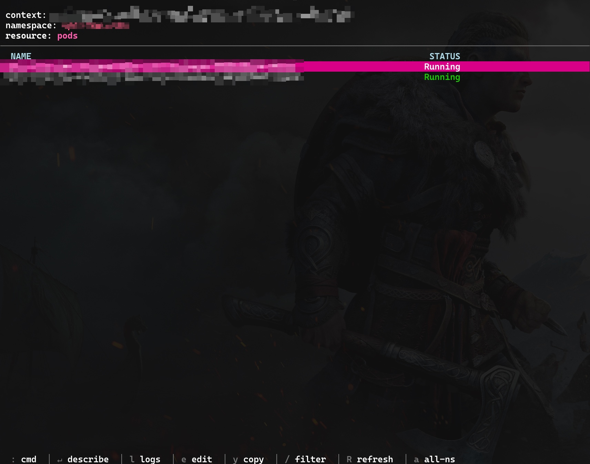

# k1s

A minimal Kubernetes TUI (Terminal User Interface) for fast cluster navigation and resource management.
It's like k9s, but hella lighter for eyes and mind. I don't have capacity to read all that k9s stuff.



## Features

- Fast, lightweight terminal UI for Kubernetes clusters
- View resource details, logs, and YAML manifests
- Manage jobs, pods and all that goodness
- Support for multiple contexts and namespaces

## Building

```bash
go build -o k1s .
```

## Usage

```bash
./k1s                              # Connect to default context/namespace
```

## Keybindings

### List View

| Key         | Action                     |
| ----------- | -------------------------- |
| `:`         | Enter command mode         |
| `/`         | Filter resources           |
| Enter / `d` | Describe selected resource |
| `l`         | View logs (pods only)      |
| `e`         | Edit resource              |
| `y`         | Copy resource name         |
| `c`         | Create job from cronjob    |
| `a`         | Toggle all-namespaces view |
| `R`         | Refresh                    |
| `Ctrl+C`    | Quit                       |

### Detail View (Describe/Logs/YAML)

| Key       | Action                |
| --------- | --------------------- |
| Esc / `q` | Back to list          |
| `/`       | Search in detail      |
| `n` / `N` | Next/previous match   |
| `g` / `G` | Top/bottom of content |
| `w`       | Toggle word wrap      |
| `y`       | View YAML             |
| Up/Down   | Scroll                |

### Commands

- `:[resource]` - switch to the resource (as written below)
- `:q` or `:quit` - Exit

## Resource Types Supported

Common Kubernetes resources:

- Pods (po)
- Deployments (deploy)
- Services (svc)
- Jobs
- CronJobs
- StatefulSets (sts)
- DaemonSets (ds)
- ConfigMaps (cm)
- Secrets
- Ingresses (ing)
- Nodes (no)
- Namespaces (ns)
- And more...

## Configuration

k1s uses kubectl's configuration, so ensure your kubeconfig is properly set up:

```bash
kubectl config current-context
kubectl config get-contexts
```

## Requirements

- kubectl installed and configured
- Access to a Kubernetes cluster
